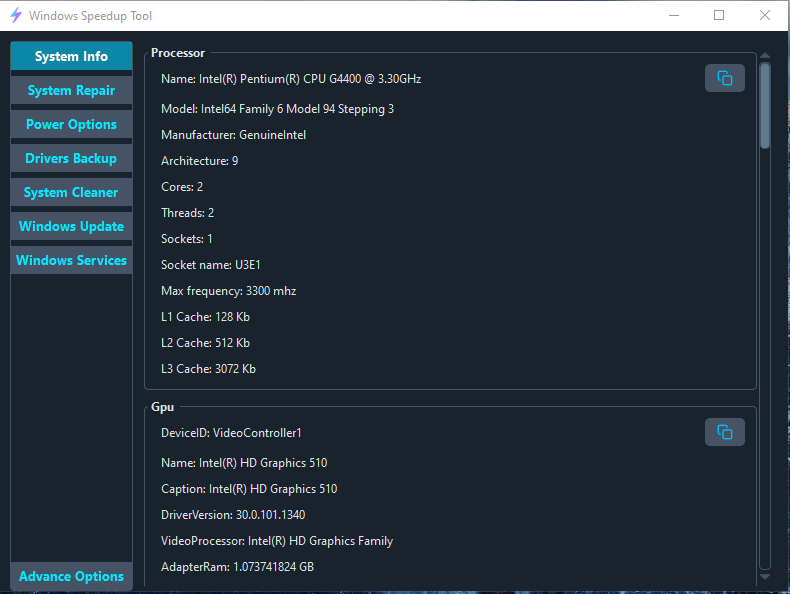

#  Windows Speedup Tool

A system performance improvement tool that provides various tools for managing system.

### App Overview:



> Currently supported os: `Windows 10`

### Features:

- **SystemInfo**: Provides comprehensive system information.
- **SystemRepair**: Offers command-line tools for repairing Windows.
- **PowerOptions**: Facilitates advanced power management and utility settings.
- **DriversBackup**: Manages backup and removal of third-party drivers.
- **SystemCleaner**: Facilitates removal of junk files and Windows update files.
- **WindowsUpdate**: Manages Windows update.
- **WindowServices**: Manages Windows services.
- **AdvancedOptions**: Manages services requiring higher privileges.

### Highlight:

Windows Speedup Tool allows services to be configured in `config.ini` file to be displayed in **Windows Services** and **Advanced Options**.

In `config.ini`, declare services as shown below to display them in **Windows Services**:

```ini
[Normal.Services]
title = Normal Services
filename = normal_services.json

[Wlan.Service]
display_name = WLAN AutoConfig
service_name = WlanSvc
startup_type = manual
```

In `config.ini`, declare services as shown below to display them in **Advanced Options**:

```ini
[Advanced.Services]
title = Advanced Services
filename = advanced_services.json

[Defender.Advanced.Service]
display_name = Windows Defender
service_name = WinDefend
startup_type = manual
```

For more than one service/services to be displayed in column of the same row use same name prefix for the section.

```ini
[Normal.Normal.Services]
title = Normal Services
filename = normal_services.json

[Normal.User.Services]
title = User Services
filename = user_services.json
```

> [!CAUTION]
> Disabling services breaks system functionality.
> Be careful about what you break.
> Disabling critical services will blue screen your system.