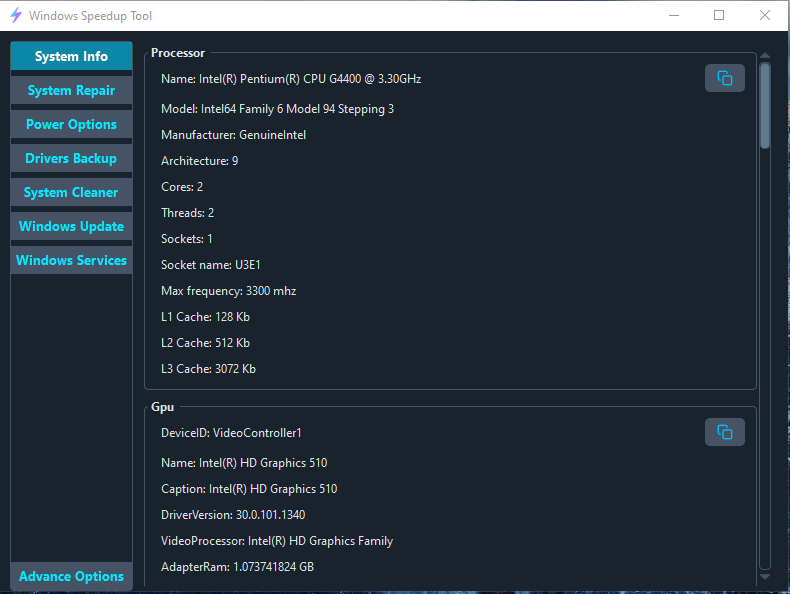

#  Windows Speedup Tool

A highly experimental tool that aims to improve system performance, provide advance insights and tools to very high extend.

This tool focuses on stripping down windows services, components to point where it's only functional and doesn't crash the system beware at the moment `Windows Services` and `Advance Options` sections aren't fully tested and may result in fatal crashes thus it's not recommended for use unless you know what it does and how it operates.

> Python version: `3.11`

# 

> Currently supported os: `windows 10`
